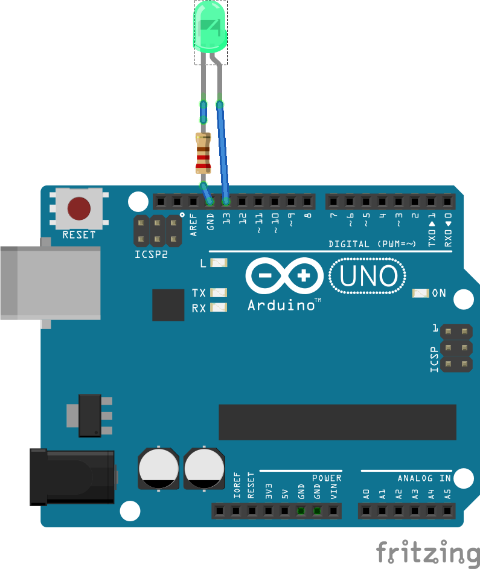
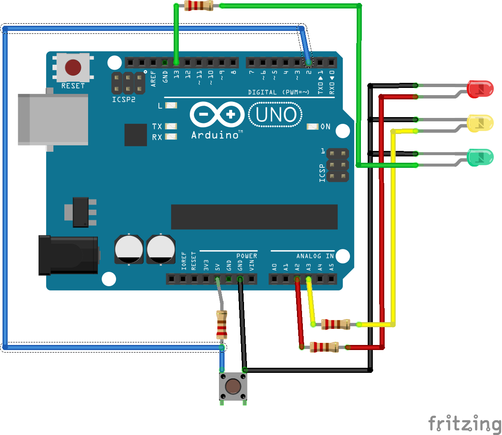
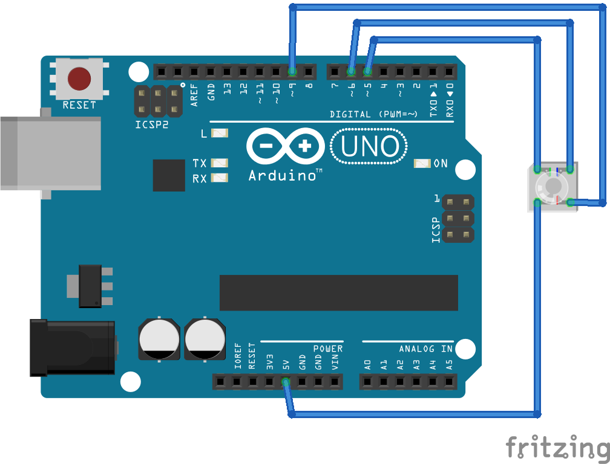

# Obsah

## [Úvod](uvod.md)

## Lekce

1. [Arduino IDE a hardware](arduino-sw-hw.md)
1. [Blikání LED](blink.md)
1. [Semafor](semafor.md)
1. [RGB LED](rgb.md)
1. [Sériová komunikace](serial.md)
1. [Displej](displej.md)
1. [Měření světla](lightscale.md)
1. [Teploměr](temperature.md)
1. [Hodiny reálného času](rtc.md)
1. [Práce s přerušením](interrupt.md)

## Pro pokročilé
1. [Sledování teploty v lednici](fridge.md)
1. [Generátor náhodných čísel](random.md)
1. [Připojení k internetu](ethernet.md)
1. [Měření a zaznamenávání dat](datalogger.md)

## Dokumentace EduShield

[Cheat sheet](cheatsheet.md)# Arduino IDE a práce s HW Arduino
## Probraná teorie
  - Instalace IDE
  - Instalace ovladače
  - Výběr desky v nastavení
  - Nastavení sériového portu
  - Nahrání aplikace do desky
  - Připojení desky k PC, spojení se shieldem
## Praktické ukázky
  - Step-by-step demonstrace probíraných témat na učitelském PC a projektoru
#	Hello World!

## Kód
[Blink.ino](../../../examples/blink/blink.ino)

## Motivace a cíle

  Blikání LED. Vysvětlit, že to je ekvivalent známého "Hello world", tedy první příklad v daném jazyce.

  Doporučujeme nejprve ukázat kód, nechat účastníky, aby jej našli v příkladech, zkompilovali, nahráli a viděli, co se děje. Teprve pak vysvětlit strukturu kódu a účel.

## Teorie
  - Logické úrovně
  - Fungování LED
  - Předřazený rezistor
  - Práce s IDE: otevřít soubor, přeložit, nahrát
  - Proměnné
  - Funkce setup() a loop()

##	Použité funkce
  - pinMode
  - digitalWrite
  - delay
  
## Zapojení

 
## Cvičení
  - Změna rychlosti blikání
  - Použití dalších LED (piny 16 a 17)
  - [Morseovka](https://cs.wikipedia.org/wiki/Morseova_abeceda)

## Pro lektora
  - Vysvětlit studentům, že delay blokuje vykonávání kódu.
#	Semafor

## Kód
[Semafor.ino](../../../examples/semafor/semafor.ino)

## Motivace a cíle

  Větší samostatná práce. Studenti vědí, jak funguje semafor, nechť tedy naprogramují samostatně jeho funkci, která cyklicky rozsvěcí jednotlivé barvy tak,
  jako na skutečném semaforu, tedy Č - Č+O - Z - O - Č...

  Další krok je využití tlačítka pro přesun do dalšího stavu

## Teorie
  - Stavový automat vs vodopád
  - Ukázka nejednoznačnosti tlačítka (zákmity atd.)
  - Prázdná smyčka (čekání na něco)
  - Tlačítka
  - Pull-up rezistor https://cs.wikipedia.org/wiki/Pull_up_rezistor 

##	Použité funkce
- digitalRead
- INPUT_PULLUP
  
## Zapojení

 
## Cvičení
  - Vyzkoušet chování bez pull-up rezistoru.
  - Upravte příklad tak, aby svítila červená, a na stisknutí tlačítka proběhl celý semaforový cyklus zpátky k červené (spouštěný automat)
  - co by bylo potřeba pro přidání funkce "semafor pro chodce" (třeba přes RGB LED)

## Pro lektora
  - Stavový automat
#	RGB

## Kód
[rgb.ino](../../../examples/rgb/rgb.ino)
[rgb_pwm.ino](../../../examples/rgb_pwm/rgb_pwm.ino)

## Motivace a cíle

  - Ukázat, jak se pracuje s RGB LED.
  - Vysvětlit míchání barev
  - PWM

## Teorie
  - Rozsvěcení nikoli přes HIGH proti zemi, ale přes LOW proti Vcc
  - RGB – míchání barevných světel. Každá barva se skládá ze tří základních světel
  - Pro pokročilejší: zmínit rozdíl mezi „mícháním světel“ a „mícháním barevných pigmentů“
  - [PWM](https://cs.wikipedia.org/wiki/Pulzn%C4%9B_%C5%A1%C3%AD%C5%99kov%C3%A1_modulace)

##	Použité funkce
  - analogWrite
  
## Zapojení

 
## Cvičení
  - Ukázka plynulých změn barvy světla
  - Změnit přírůstky/úbytky pro PWM. (Student by si měl všimnout, že od určité hranice svítí LED plně. Vysvětlit důvod: minimální napětí nutné pro rozsvícení)

## Pro lektora
  - Volitelně: vysvětlit důvody spínání proti Vcc
#	Sériová komunikace

## Kód
[SerialCommunication.ino](../../../examples/SerialCommunication/SerialCommunication.ino)

## Motivace a cíle

  - Využití sériové komunikace via UART pro ladění programu.
  - Vysvětlit princip sériové komunikace

## Teorie
  - RS232 https://cs.wikipedia.org/wiki/RS-232 
  - Arduino IDE Serial Monitor
  - Převodník USB-Serial
    - 5 V vs 3,3 V
  - AT příkazy
    - Bluetooth modul
  - HW serial port na Arduino
    - Arduino Mega
  - SW serial port na Arduino

##	Použité funkce
  - [Serial](https://www.arduino.cc/en/Reference/Serial)
  
## Zapojení

---
 
## Cvičení
  - Ovládejte LED pomocí příkazů poslaných přes sériovou linku.
  - Vyzkoušejte, co se stane, když nejsou na obou stranách nastaveny stejné rychlosti.

## Pro lektora
  - Místo readString() použijte jen read()
#	Displej ze sedmisegmentovek

## Kód
[hello.ino](../../../examples/hello/hello.ino)

## Motivace a cíle

  Ukázka práce s I2C zařízením pomocí knihovny

## Teorie
  - Nalezení správného postupu v knihovně
  - Implementace vlastního postupu
  - Ovládání hardware napřímo, pokud knihovna nenabízí požadované

##	Použité funkce
- Wire
- knihovna Edushield.h
  
## Zapojení

## Cvičení
  - Přidat tabulku nejčastějších znaků
  - Vytvoření vlastní knihovny (pro pokročilé)

## Pro lektora
  - Je třeba prozkoumat knihovnu a nalézt místo, kde se posílají data do displeje. 
  - Experimentálně zjistěte rozložení segmentů #	Měření intenzity světla

## Kód
[LightScale.ino](../../../examples/LightScale/LightScale.ino)

## Motivace a cíle

  Intenzita světla se převede na LED, které se budou chovat jako škála. Hodnota načtená z analogového senzoru se vypíše na sériovou konzoli.

  Ukázka čtení analogových hodnot, princip ADC

## Teorie
  - Analogový senzor
  - ADC https://cs.wikipedia.org/wiki/A/D_p%C5%99evodn%C3%ADk 
  - Vzorkovací frekvence https://cs.wikipedia.org/wiki/Vzorkov%C3%A1n%C3%AD
  - Dělič napětí https://cs.wikipedia.org/wiki/D%C4%9Bli%C4%8D_nap%C4%9Bt%C3%AD 

##	Použité funkce
  - analogRead
  - map

  
## Zapojení

 
## Cvičení
  - Výpočet napětí na senzoru.
  - Změna citlivosti posunem rozsahu ve funkci map.

## Pro lektora
  - Referenční napětí je 5 V, převodník je 10-bit, tedy 0-1023.
  - Díky napěťovému děliči určité hranice nemusejí mít vliv. Citlivost obecně závisí na použitém rezistoru připojeného na zem.
  - Je třeba najít mez citlivosti.

  ## Prerekvizity

  1. [Sériová komunikace](serial.md)
  1. [Displej](displej.md)
  1. [Blikání LED](blink.md)#	Měření teploty

## Kód
[MeasureTemperature.ino](../../../examples/MeasureTemperature/MeasureTemperature.ino)

## Motivace a cíle

  Nahradit teploměr za fotorezistor z předchozího příkladu a vypisovat hodnoty na sériové lince

  Teplota se zobrazí na displeji

## Teorie
  - Instalace knihovny v IDE a ručně.
  - Elektrotechnické schéma a značky.

##	Použité funkce
  - pinMode
  - digitalWrite
  - delay
  
## Zapojení

 
## Cvičení
  - Při dosažení zvolené teploty rozsvítit LED.
  - Teplotu zobrazit v °F https://cs.wikipedia.org/wiki/Stupe%C5%88_Fahrenheita. 
  - Vytvořit počítadlo průchodů lidí nebo předmětů pomocí světelného senzoru.

## Pro lektora
  - Není třeba přepočítávat na reálnou teplotu. Stačí surová hodnota ze senzoru, ušetří se výpočetní výkon, paměť, …
  - Účastníci si musí najít, jak zobrazit F. Je třeba je nasměrovat na zdrojové soubory knihovny Edushield.
  - Nastavením citlivosti senzoru na světlo vytvořit hranici, kdy zastínění bude odpovídat průchodu člověka nebo předmětu.

## Prerekvizity

1. [Displej](displej.md)
1. [Měření světla](lightscale.md)
1. [Blikání LED](blink.md)#	Hodiny reálného času

## Kód
[Clock.ino](../../../examples/Clock/Clock.ino)
[RealTimeClock.ino](../../../examples/RealTimeClock/RealTimeClock.ino)

## Motivace a cíle

  Ukázka praktické aplikace. Práce s RTC. Práce s knihovnami. Nahrazení knihovních funkcí low-level přístupem k zařízení. Výpis hodnot do počítače přes UART.

## Teorie
  - Instalace knihovny pomocí správce knihoven
  - Práce s katalogovým listem http://datasheets.maximintegrated.com/en/ds/DS1307.pdf 
  - BCD kódování https://cs.wikipedia.org/wiki/BCD
  - Rozhraní I2C na aplikační úrovni http://www.nxp.com/documents/user_manual/UM10204.pdf

##	Použité funkce
  - knihovna Wire
  
## Cvičení
  - Zobrazit minuty a sekundy
  - Zobrazit kompletní datum a čas na sériovou konzoli.

## Pro lektora
  - Referenční napětí je 5 V, převodník je 10-bit, tedy 0-1023.
  - Díky napěťovému děliči určité hranice nemusejí mít vliv. Citlivost obecně závisí na použitém rezistoru připojeného na zem.
  - Je třeba najít mez citlivosti.

  ## Prerekvizity

  1. [Sériová komunikace](serial.md)
  1. [Displej](displej.md)
# Námět: Sledování teploty v lednici

  -	Aplikace uchovává maximální a minimální teplotu.
  - Typ zobrazené teploty je indikován LED.
  - Pokud je lednice otevřená déle než 10 sekund, tak začne vše blikat
# Námět: Generátor náhodných čísel

  - https://cs.wikipedia.org/wiki/Gener%C3%A1tor_n%C3%A1hodn%C3%BDch_%C4%8D%C3%ADsel
  - http://www.root.cz/clanky/hardwarovy-generator-nahodnych-cisel-aneb-nahoda-z-atomu/

1.	Čteme nejnižší bit A/D převodníku, ke kterému je připojený zdroj šumu (dioda, nebo fotorezistor / termistor). 
2.	Sebrat vzorek 1000 / 10000 / 100 000 náhodných čísel, podívat se, jak náhodná jsou (rovnoměrné rozdělení atd.)
3.	Cvičení z pilnosti: zakreslit např. průběh šumu do grafu; podívat se, jestli šum roste s teplem (u diody ano, stačilo cvaknout zapalovačem) ;)
# EduShield

## Digitální piny

| Pin | Funkce   |
| --- | --- |
| 2   | Tlačítko |
| 3   | RTC SQW out |
| 4   | --- |
| 5   | RGB LED: G |
| 6   | RGB LED: B |
| 7   | --- |
| 8   | --- |
| 9   | RGB LED: R |
| 10   | --- |
| 11   | --- |
| 12   | --- |
| 13 | Semafor: zelená |
| 14 | -- |
| 15 | -- |
| 16 | Semafor: červená |
| 17 | Semafor: oranžová |
| 18 | I2C SDA |
| 19 | I2C SCK |

## Analogové vstupy

| Pin | Funkce   |
| --- | --- |
| A1  | fotorezistor |
| A2  | termistor |

## Funkční bloky

### LED semafor
  Piny 13 (zelená), 16 (červená), 17 (oranžová)

### RGB LED  
  Piny 5 (G - zelená), 6 (B - modrá), 9 (R - červená)

  Možno pustit PWM

### Tlačítko
  Pin 2
  
  Nastavit jako INPUT PULLUP  

## Displej
  I2C slave 0x27
  
  Protokol: vždy se přenáší 2 byty, první udává pozici, druhý segmenty

## RTC
  I2C slave device 0x68

