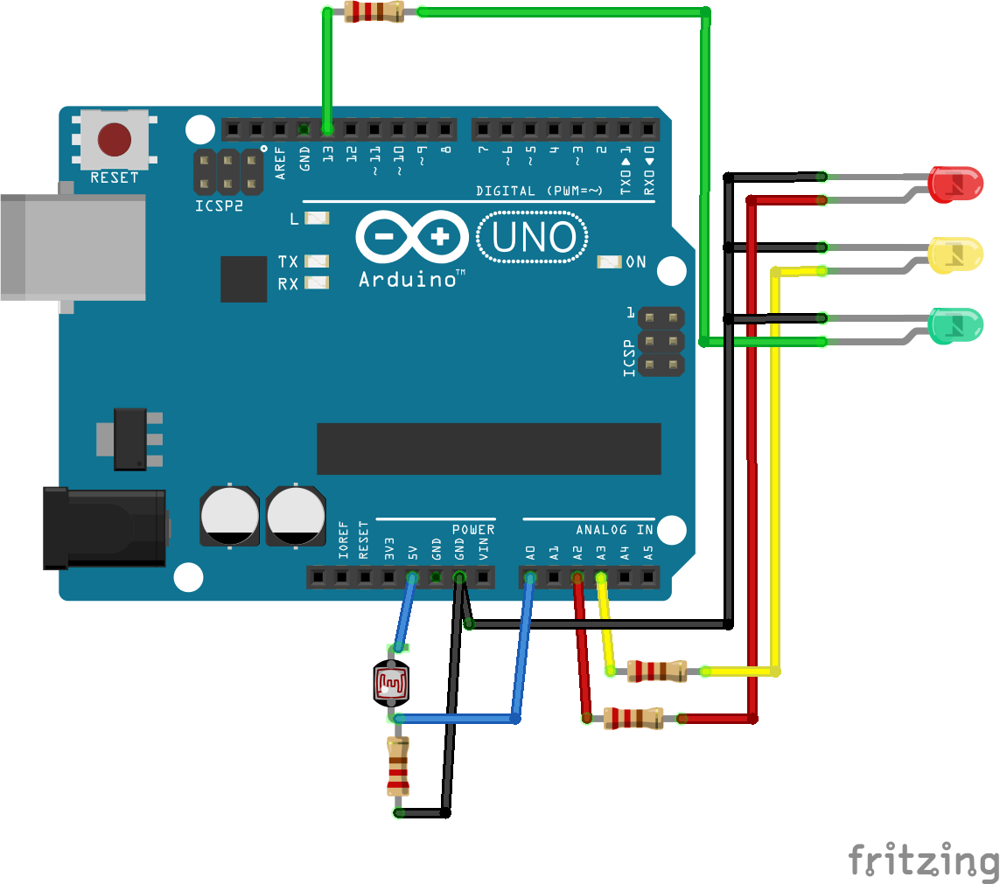

#	Měření intenzity světla

## Kód
[LightScale.ino](../../../examples/LightScale/LightScale.ino)

## Motivace a cíle

  Intenzita světla se převede na LED, které se budou chovat jako škála. Hodnota načtená z analogového senzoru se vypíše na sériovou konzoli.

  Ukázka čtení analogových hodnot, princip ADC

## Teorie
  - Analogový senzor
  - ADC https://cs.wikipedia.org/wiki/A/D_p%C5%99evodn%C3%ADk 
  - Vzorkovací frekvence https://cs.wikipedia.org/wiki/Vzorkov%C3%A1n%C3%AD
  - Dělič napětí https://cs.wikipedia.org/wiki/D%C4%9Bli%C4%8D_nap%C4%9Bt%C3%AD 

##	Použité funkce
  - analogRead
  - map

  
## Zapojení

 
## Cvičení
  - Výpočet napětí na senzoru.
  - Změna citlivosti posunem rozsahu ve funkci map.

## Pro lektora
  - Referenční napětí je 5 V, převodník je 10-bit, tedy 0-1023.
  - Díky napěťovému děliči určité hranice nemusejí mít vliv. Citlivost obecně závisí na použitém rezistoru připojeného na zem.
  - Je třeba najít mez citlivosti.
