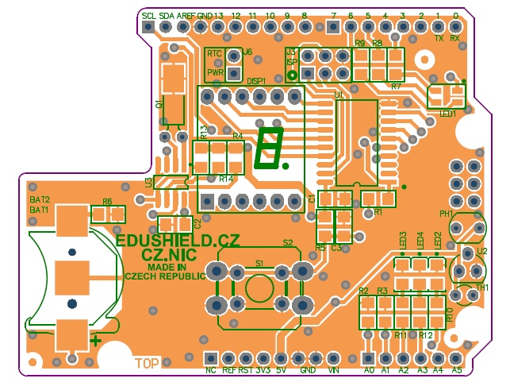

## Úvod

EduShield byl vytvořen pro výuku základů práce s elektronikou a Internetem věcí. Jeho primárním cílem je přinést jednoduchý a cenově dostupný způsob, jakým mohou zájemci z věkové skupiny 12+ získat základní i rozšířenou sadu kompetencí v oblasti mikroelektroniky, programování elektronických zařízení a propojování věcí z reálného světa s digitální technologií.

EduShield je otevřená technologie, navržená tak, že spolupracuje s nejrozšířenější elektronickou platformou dneška, s vývojovým kitem Arduino. Výhodou tohoto kitu je nízká cena, příznivá křivka učení a obrovská dostupnost rozšiřujících zařízení, díky nimž je možné použít Arduino jako platformu pro sběr dat, pro řízení strojů, pro vývoj elektronických zařízení i pro výuku nejrůznějších technik a technologií.

EduShield byl navržen na základě zkušeností s kurzy základů elektroniky, kterými prošlo přes 400 lidí. Zohledňuje potřeby a cíle výuky jak pro základní seznámení, tak i pro pokročilejší techniky. Rozvíjí kompetence v oblastech práce s elektronickými zařízeními, od programování po jejich reálný návrh. Učí frekventanty, jak spojit reálný svět s digitálním, ukazuje způsoby měření fyzikálních veličin a techniky pro interakci s lidmi. Předpokladem pro úspěšné absolvování kurzu jsou znalosti základů elektroniky. Tyto znalosti jsou v průběhu kurzu upevněny a jsou posíleny o kompetence tzv. extrémního programování. Účastníci zároveň získávají důležité kompetence v oblasti inteligentních systémů řízení, Internetu věcí, automatizace a regulace, a v oblasti návrhu a testování elektronických obvodů.

## Prerekvizity
  - Znalost základů programování v jazyce, který vychází z jazyka C (C, Java, C++, C#, JavaScript, PHP a další). Požadovaná úroveň: znalost konceptu proměnných, konstant, funkcí a základních konstrukcí programovacího jazyka (smyčky, podmínky)
  - Fakultativní: znalost fyzikálních principů elektřiny (napětí, proud, funkce el. obvodů)
3	Příprava pro studenty
  - Instalace IDE. Arduino IDE je dostupné pro Linux, Mac a Windows [http://www.arduino.cc/en/Main/Software]. 
  - [Zdrojové kódy ukázkových aplikací](https://github.com/maly/edushield/releases) Stačí vybrat Download ZIP. Součástí balíku jsou i knihovny pro použité rozšíření.
  - Schéma shieldu a datasheet pro použité obvody

## Příprava pro lektora

  Vše si nejdříve vyzkoušejte, než začnete školit, nebo se sami tohoto školení zúčastněte!

  Pro každého studenta je potřeba mít připraveno: 

###	Než začne seminář
  - Poslat studentům odkaz, co si mají stáhnout a nainstalovat
    -  https://www.arduino.cc/en/Main/Software 
    -  https://github.com/maly/edushield/releases
  - Připravený hardware
    -  Arduino Uno nebo klon. U klonů pozor na nutnost instalace ovladačů!
    -  EduShield
  -	Připravený USB flash disk ke každému hardware, a na něm:
    -  Arduino IDE pro všechny platformy, kdyby někdo zapomněl.
    -  Zdrojové kódy z https://bitbucket.org/maly/edushield/src
    -  Všechny potřebné knihovny.
    - Ovladače
  -  Vytisknout pro každého účastníka:
    -  Arduino Cheat Sheet https://github.com/liffiton/Arduino-Cheat-Sheet 
    -  EduShield Cheat Sheet.docx

### Příprava knihovny

  Obsah ZIPu nahrát do podadresáře Libraries. Tím se příklady objeví v "Příkladech z knihoven"

###	Instalace ovladačů
  Podle operačního systému a použité desky se může instalace ovladačů lišit. Systém musí desku Arduino rozpoznat jako sériový port. Pro převod USB na sériový port se používají dva typy čipů.

  - FTDI (http://www.ftdichip.com) – nejčastěji u dražších Arduino. Některé klony Arduino mohou obsahovat čip, který je kopií čipu od společnosti FTDI. S těmito čipy mohou mít oficiální ovladače problémy.
  - CH340 – levná alternativa čipů FTDI. Většinou najdete ve velmi levných klonech Arduino. Viz https://iotta.cz/ovladace-pro-ch340g/

#### Mac OS
  
  Pokud není zařízení rozpoznáno, je třeba nainstalovat ovladač z https://iotta.cz/ovladace-pro-ch340g/ 

  Další alternativy: 
  -  http://www.wch.cn/download/CH341SER_MAC_ZIP.html 
  -  http://0xcf.com/2015/03/13/chinese-arduinos-with-ch340-ch341-serial-usb-chip-on-os-x-yosemite/ 

#### Linux
  
  Arduino by mělo být rozpoznáno automaticky s čipem FTDI i CH340. Uživatel musí být ve skupině dialup, aby měl přístup k sériovému portu a nemusel Arduino IDE spouštět přes sudo. 
  
  Testované distribuce
  - Ubuntu 14.04 LTS
  - Ubuntu 15.04
  - Ubuntu 16.04

#### Windows 10

Instalace ovladačů proběhne automaticky. Vyžaduje připojení k internetu.

#### Windows 8.1, 8, 7

Pokud se ovladače nenainstalují automaticky, tak je třeba ovladač nainstalovat ručně. Umístění ovladačů:
  - Ovladače pro FTDI čip jsou součástí Arduino IDE.
  - Ovladač pro CH340 čip: https://iotta.cz/ovladace-pro-ch340g/  

####	Instalace nepodepsaných ovladačů
Při instalaci ovladačů na 64-bit verze Windows může výjimečně dojít k problému s digitálním podpisem ovladače. Nové verze ovladačů pro čip FTDI jsou podepsané. Může být problém s ovladačem pro CH340, ale neměl by být. Pokud systém odmítne instalaci ovladače kvůli digitálnímu podpisu, tak postupujte podle tohoto návodu http://robodoupe.cz/wp-content/uploads/2013/04/Arduino-a-PICAXE-na-Windows-8-64.pdf 

### Poznámka: Arduino.cc vs. Arduino.org
V nedávné době došlo k rozkolu mezi zakladateli projektu Arduino (http://hackaday.com/tag/arduino-vs-arduino/). V tuto chvíli existují dvě Arduino IDE. Jedno ze stránek Arduino.cc a druhé za stránek Arduino.org. Každé má trochu jiné vlastnosti a v základu podporuje jinou sadu desek Arduino. V příkladech budeme používat Arduino IDE z Arduino.cc.

# S čím budeme učit
##	Hardware
###	Arduino UNO
  Arduino je jednoduchá vývojová deska s mikrořadičem AVR společnosti ATMEL. Na této desce najdete vše potřebné pro vytváření jednoduchého hardware pro domácí automatizaci, robotiku, interaktivní instalace a mnoho dalšího.
### EduShield
  EduShield je deska pro Arduino, vyvinutá speciálně pro potřeby výuky základů mikroelektroniky a práce s ní. Desku vyrání sdružení [CZ.NIC](https://nic.cz)

 
##	Software
###	Arduino IDE
  Arduino IDE je vývojové prostředí, pomocí kterého budete psát aplikace pro vývojové desky Arduino a zároveň umožňuje aplikaci na vývojovou desku Arduino nahrát.
